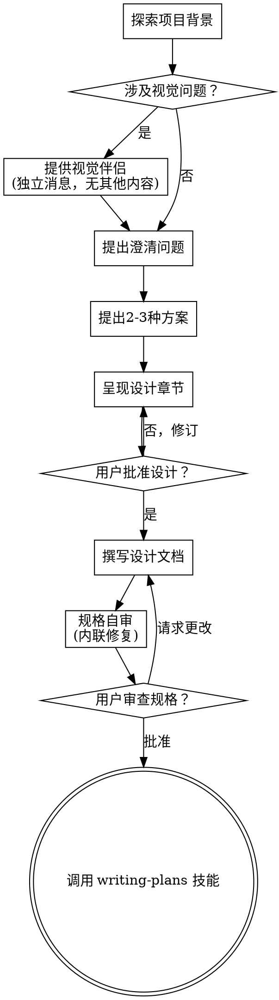

# 将创意转化为设计

通过自然的协作对话，帮助将想法转化为完整的设计和规格说明。

首先理解当前项目背景，然后逐一提出问题以完善想法。一旦你理解了要构建什么，就呈现设计并获得用户批准。

<HARD-GATE>
在呈现设计并获得用户批准之前，请勿调用任何实施技能、编写任何代码、搭建任何项目或采取任何实施行动。无论项目看起来多么简单，此规则适用于每个项目。
</HARD-GATE>

## 反模式：“这太简单了，不需要设计”

每个项目都必须经过此流程。待办事项列表、单一功能工具、配置更改——所有项目都是如此。“简单”项目往往因未经审视的假设而导致最多的工作浪费。设计可以简短（对于真正简单的项目，只需几句话），但你必须呈现它并获得批准。

## 检查清单

你必须为以下每个项目创建任务并按顺序完成：

1. **探索项目背景**——检查文件、文档、最近提交
2. **提供视觉伴侣**（如果主题涉及视觉问题）——这是独立的消息，不与澄清问题合并。请参阅下面的视觉伴侣部分。
3. **提出澄清问题**——逐一理解目的/约束/成功标准
4. **提出2-3种方案**——附带权衡和你的推荐
5. **呈现设计**——按复杂度分节呈现，每节后获得用户批准
6. **撰写设计文档**——保存到 `docs/superpowers/specs/YYYY-MM-DD-<主题>-design.md` 并提交
7. **规格自审**——快速内联检查占位符、矛盾、歧义、范围（见下文）
8. **用户审查书面规格**——请用户在继续之前审查规格文件
9. **过渡到实施**——调用 writing-plans 技能创建实施计划

## 流程图示

**终端状态是调用 writing-plans。** 请勿调用 frontend-design、mcp-builder 或任何其他实施技能。头脑风暴后调用的唯一技能是 writing-plans。

## 流程详解

**理解想法：**

- 首先查看当前项目状态（文件、文档、最近提交）
- 在提出详细问题之前，评估范围：如果请求描述了多个独立的子系统（例如，“构建一个包含聊天、文件存储、计费和数据分析的平台”），请立即标记。不要花费问题去细化一个需要首先分解的项目细节。
- 如果项目对于单个规格来说太大，帮助用户分解为子项目：哪些是独立部分，它们如何关联，应按什么顺序构建？然后通过正常的设计流程对第一个子项目进行头脑风暴。每个子项目都有自己的规格 → 计划 → 实施周期。
- 对于范围适当的项目，逐一提出问题以完善想法
- 尽可能使用多项选择题，但开放式问题也可以
- 每条消息只提一个问题——如果一个主题需要更多探索，将其分解为多个问题
- 专注于理解：目的、约束、成功标准

**探索方案：**

- 提出2-3种不同的方案，附带权衡
- 以对话方式呈现选项，附带你的推荐和理由
- 首先提出你的推荐选项并解释原因

**呈现设计：**

- 一旦你确信理解了要构建什么，就呈现设计
- 根据复杂度调整每个章节：如果直接明了，只需几句话；如果复杂，最多200-300字
- 每个章节后询问是否看起来正确
- 涵盖：架构、组件、数据流、错误处理、测试
- 如果某些内容不清楚，准备好返回澄清

**为隔离性和清晰性而设计：**

- 将系统分解为较小的单元，每个单元具有一个明确的目的，通过定义良好的接口进行通信，并且可以独立理解和测试
- 对于每个单元，你应该能够回答：它做什么，如何使用它，它依赖什么？
- 是否有人可以在不阅读其内部实现的情况下理解一个单元的功能？你是否可以在不破坏消费者的情况下更改内部实现？如果不能，边界需要调整。
- 较小、边界清晰的单元也更容易让你处理——你可以更好地推理你能一次性在上下文中把握的代码，并且当文件聚焦时，你的编辑更可靠。当一个文件变得庞大时，这通常表明它承担了太多职责。

**在现有代码库中工作：**

- 在提出更改之前探索当前结构。遵循现有模式。
- 如果现有代码存在问题并影响工作（例如，文件变得太大、边界不清、职责混乱），将有针对性的改进作为设计的一部分——就像优秀的开发人员改进他们正在工作的代码一样。
- 不要提出无关的重构。专注于服务于当前目标的内容。

## 设计之后

**文档：**

- 将经过验证的设计（规格）写入 `docs/superpowers/specs/YYYY-MM-DD-<主题>-design.md`
  - （用户对规格位置的偏好会覆盖此默认设置）
- 如果可用，使用 elements-of-style:writing-clearly-and-concisely 技能
- 将设计文档提交到 git

**规格自审：**
撰写规格文档后，以新的视角审视它：

1. **占位符扫描：** 是否有“待定”、“待办”、不完整的章节或模糊的需求？修复它们。
2. **内部一致性：** 是否有章节相互矛盾？架构是否与功能描述匹配？
3. **范围检查：** 这是否足够聚焦于单个实施计划，还是需要分解？
4. **歧义检查：** 是否有任何需求可能被解释为两种不同的方式？如果是，选择一种并使其明确。

内联修复任何问题。无需重新审查——只需修复并继续。

**用户审查关卡：**
规格审查循环通过后，请用户在继续之前审查书面规格：

> “规格已撰写并提交到 `<路径>`。请在开始编写实施计划之前审查它，并告知是否需要任何更改。”

等待用户的回应。如果他们请求更改，进行更改并重新运行规格审查循环。只有在用户批准后才继续。

**实施：**

- 调用 writing-plans 技能创建详细的实施计划
- 请勿调用任何其他技能。writing-plans 是下一步。

## 关键原则

- **一次一个问题**——不要用多个问题压倒用户
- **优先多项选择**——在可能的情况下比开放式问题更容易回答
- **严格遵循YAGNI**——从所有设计中移除不必要的功能
- **探索替代方案**——在确定前始终提出2-3种方案
- **增量验证**——呈现设计，获得批准后再继续
- **保持灵活**——当某些内容不清楚时，返回澄清

## 视觉伴侣

一个基于浏览器的伴侣，用于在头脑风暴期间展示线框图、图表和视觉选项。作为工具提供——不是模式。接受伴侣意味着它可用于受益于视觉处理的问题；这并不意味着每个问题都通过浏览器进行。

**提供伴侣：** 当你预期即将到来的问题将涉及视觉内容（线框图、布局、图表）时，提供一次以获取同意：
> “我们正在处理的一些内容，如果能在浏览器中展示给你看，可能会更容易解释。我可以随着进展准备线框图、图表、比较和其他视觉内容。此功能仍较新且可能消耗较多令牌。想试试吗？（需要打开本地URL）”

**此提供必须是独立的消息。** 不要将其与澄清问题、背景摘要或任何其他内容合并。消息应仅包含上述提供内容，别无其他。等待用户的回应后再继续。如果他们拒绝，继续进行纯文本头脑风暴。

**逐问题决策：** 即使用户接受后，也要为每个问题决定是使用浏览器还是终端。测试标准：**用户通过看到它比阅读它更能理解吗？**

- **使用浏览器**处理视觉内容——线框图、布局比较、架构图、并排视觉设计
- **使用终端**处理文本内容——需求问题、概念选择、权衡列表、A/B/C/D 文本选项、范围决策

关于UI主题的问题不自动是视觉问题。“在此上下文中‘个性’意味着什么？”是一个概念问题——使用终端。“哪个向导布局更好？”是一个视觉问题——使用浏览器。

如果他们同意使用伴侣，请在继续前阅读详细指南：
`skills/brainstorming/visual-companion.md`
