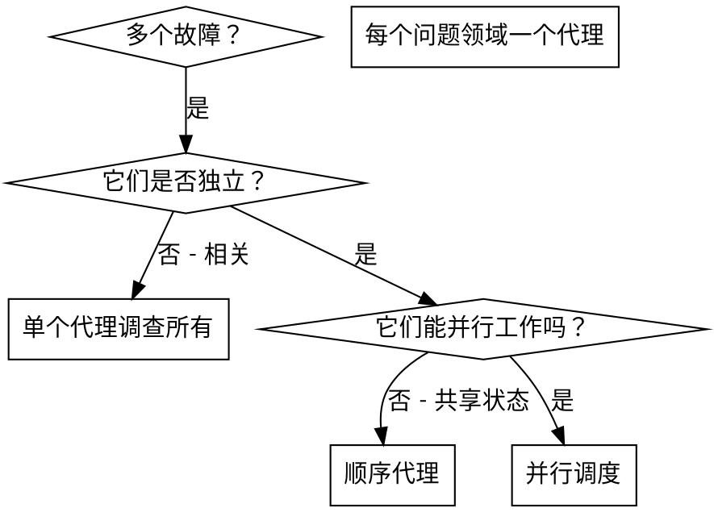

# 并行代理调度

## 概述

您将任务委托给具有隔离上下文的专业代理。通过精心设计指令和上下文，确保它们保持专注并成功完成任务。它们绝不应继承您会话的上下文或历史记录——您需精确构建它们所需的内容。这也能保留您自身的上下文以进行协调工作。

当您遇到多个不相关的故障（不同的测试文件、不同的子系统、不同的错误）时，按顺序调查会浪费时间。每个调查都是独立的，可以并行进行。

**核心原则：** 为每个独立的问题领域分派一个代理。让它们并发工作。

## 使用时机



**在以下情况使用：**
- 3个以上测试文件因不同根本原因而失败
- 多个子系统独立损坏
- 每个问题无需其他问题的上下文即可理解
- 调查之间没有共享状态

**不要在以下情况使用：**
- 故障相互关联（修复一个可能修复其他）
- 需要理解完整的系统状态
- 代理会相互干扰

## 模式

### 1. 识别独立领域

按损坏内容对故障进行分组：
- 文件A测试：工具审批流程
- 文件B测试：批量完成行为
- 文件C测试：中止功能

每个领域都是独立的——修复工具审批不会影响中止测试。

### 2. 创建专注的代理任务

每个代理获得：
- **特定范围：** 一个测试文件或子系统
- **明确目标：** 使这些测试通过
- **约束：** 不要更改其他代码
- **预期输出：** 发现和修复内容的摘要

### 3. 并行调度

```typescript
// 在 Claude Code / AI 环境中
Task("修复 agent-tool-abort.test.ts 故障")
Task("修复 batch-completion-behavior.test.ts 故障")
Task("修复 tool-approval-race-conditions.test.ts 故障")
// 所有三个任务并发运行
```

### 4. 审查与集成

当代理返回时：
- 阅读每个摘要
- 验证修复不冲突
- 运行完整测试套件
- 集成所有更改

## 代理提示结构

良好的代理提示应：
1. **专注** - 一个明确的问题领域
2. **自包含** - 理解问题所需的所有上下文
3. **输出具体** - 代理应返回什么？

```markdown
修复 src/agents/agent-tool-abort.test.ts 中的 3 个失败测试：

1. "should abort tool with partial output capture" - 期望消息中包含 'interrupted at'
2. "should handle mixed completed and aborted tools" - 快速工具被中止而非完成
3. "should properly track pendingToolCount" - 期望 3 个结果但得到 0

这些是时序/竞态条件问题。您的任务：

1. 阅读测试文件并理解每个测试验证的内容
2. 识别根本原因 - 是时序问题还是实际错误？
3. 通过以下方式修复：
   - 用基于事件的等待替换任意超时
   - 如果发现中止实现中的错误，则修复它们
   - 如果测试行为已更改，则调整测试期望

不要仅仅增加超时时间——找到真正的问题。

返回：您发现的内容和修复内容的摘要。
```

## 常见错误

**❌ 范围太广：** "修复所有测试" - 代理会迷失方向
**✅ 具体：** "修复 agent-tool-abort.test.ts" - 专注的范围

**❌ 无上下文：** "修复竞态条件" - 代理不知道在哪里
**✅ 提供上下文：** 粘贴错误消息和测试名称

**❌ 无约束：** 代理可能重构所有内容
**✅ 设置约束：** "不要更改生产代码" 或 "仅修复测试"

**❌ 输出模糊：** "修复它" - 您不知道更改了什么
**✅ 具体输出：** "返回根本原因和更改的摘要"

## 何时不应使用

**相关故障：** 修复一个可能修复其他——先一起调查
**需要完整上下文：** 理解需要查看整个系统
**探索性调试：** 您还不知道哪里损坏了
**共享状态：** 代理会相互干扰（编辑相同文件、使用相同资源）

## 会话中的真实示例

**场景：** 重大重构后，3个文件出现6个测试失败

**故障：**
- agent-tool-abort.test.ts: 3个故障（时序问题）
- batch-completion-behavior.test.ts: 2个故障（工具未执行）
- tool-approval-race-conditions.test.ts: 1个故障（执行计数 = 0）

**决策：** 独立领域——中止逻辑与批量完成分离，与竞态条件分离

**调度：**
```
代理 1 → 修复 agent-tool-abort.test.ts
代理 2 → 修复 batch-completion-behavior.test.ts
代理 3 → 修复 tool-approval-race-conditions.test.ts
```

**结果：**
- 代理 1：用时序事件等待替换超时
- 代理 2：修复了事件结构错误（threadId 位置错误）
- 代理 3：添加了等待异步工具执行完成的逻辑

**集成：** 所有修复独立，无冲突，完整套件通过

**节省时间：** 并行解决3个问题 vs 顺序解决

## 主要优势

1. **并行化** - 多个调查同时进行
2. **专注** - 每个代理范围狭窄，需要跟踪的上下文更少
3. **独立性** - 代理互不干扰
4. **速度** - 解决3个问题的时间相当于解决1个

## 验证

代理返回后：
1. **审查每个摘要** - 理解更改内容
2. **检查冲突** - 代理是否编辑了相同的代码？
3. **运行完整套件** - 验证所有修复协同工作
4. **抽查** - 代理可能犯系统性错误

## 实际影响

来自调试会话（2025-10-03）：
- 3个文件出现6个故障
- 并行调度3个代理
- 所有调查并发完成
- 所有修复成功集成
- 代理更改之间零冲突
