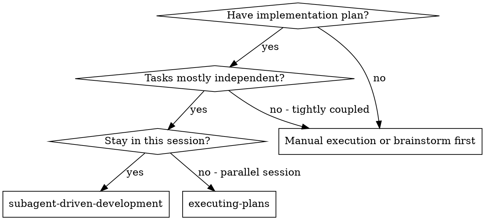
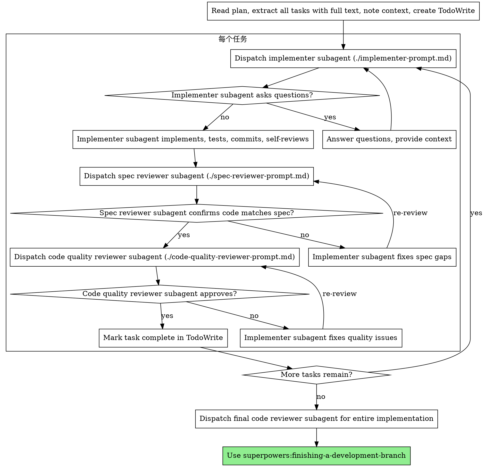

# 子代理驱动开发

通过为每个任务派遣全新的子代理来执行计划，每个任务完成后进行两阶段评审：先进行规范符合性评审，再进行代码质量评审。

**为何使用子代理：** 你将任务委托给具有独立上下文的专业代理。通过精心设计指令和上下文，确保它们保持专注并成功完成任务。它们绝不应继承你当前会话的上下文或历史记录——你只构建它们所需的内容。这也为你自己的协调工作保留了上下文。

**核心原则：** 每个任务使用全新子代理 + 两阶段评审（先规范后质量）= 高质量、快速迭代

## 何时使用



**对比执行计划（并行会话）：**
- 同一会话（无需切换上下文）
- 每个任务使用全新子代理（无上下文污染）
- 每个任务后进行两阶段评审：先规范符合性，再代码质量
- 迭代更快（任务间无需人工介入）

## 流程



## 模型选择

使用能够胜任每个角色的最低能力模型，以节省成本并提高速度。

**机械性实现任务**（独立函数、明确规范、1-2个文件）：使用快速、廉价的模型。当计划制定得当时，大多数实现任务都是机械性的。

**集成和判断任务**（多文件协调、模式匹配、调试）：使用标准模型。

**架构、设计和评审任务**：使用可用的最强大模型。

**任务复杂度信号：**
- 涉及1-2个文件且规范完整 → 廉价模型
- 涉及多个文件且有集成问题 → 标准模型
- 需要设计判断或广泛的代码库理解 → 最强大模型

## 处理实现者状态

实现者子代理报告四种状态之一。请适当处理每种状态：

**完成：** 继续进行规范符合性评审。

**完成但有顾虑：** 实现者完成了工作但标记了疑虑。在继续之前阅读这些顾虑。如果顾虑涉及正确性或范围，请在评审前解决。如果只是观察（例如“这个文件变得很大”），请记下它们并继续评审。

**需要上下文：** 实现者需要未提供的信息。提供缺失的上下文并重新派遣。

**受阻：** 实现者无法完成任务。评估阻碍因素：
1. 如果是上下文问题，提供更多上下文并使用相同模型重新派遣
2. 如果任务需要更多推理，使用更强大的模型重新派遣
3. 如果任务太大，将其分解为更小的部分
4. 如果计划本身有误，上报给人类

**切勿**忽略上报或在不做任何更改的情况下强制同一模型重试。如果实现者表示受阻，则必须做出某些改变。

## 提示模板

- `./implementer-prompt.md` - 派遣实现者子代理
- `./spec-reviewer-prompt.md` - 派遣规范符合性评审者子代理
- `./code-quality-reviewer-prompt.md` - 派遣代码质量评审者子代理

## 示例工作流

```
你：我正在使用子代理驱动开发来执行这个计划。

[一次性读取计划文件：docs/superpowers/plans/feature-plan.md]
[提取所有5个任务的完整文本和上下文]
[创建包含所有任务的TodoWrite]

任务1：钩子安装脚本

[获取任务1文本和上下文（已提取）]
[派遣实现子代理，附带完整任务文本+上下文]

实现者：“开始之前——钩子应该安装在用户级别还是系统级别？”

你：“用户级别（~/.config/superpowers/hooks/）”

实现者：“明白了。现在开始实现...”
[稍后] 实现者：
  - 实现了install-hook命令
  - 添加了测试，5/5通过
  - 自审：发现我漏掉了--force标志，已添加
  - 已提交

[派遣规范符合性评审者]
规范评审者：✅ 符合规范 - 所有要求已满足，无额外内容

[获取git SHA，派遣代码质量评审者]
代码评审者：优点：测试覆盖良好，代码整洁。问题：无。已批准。

[标记任务1完成]

任务2：恢复模式

[获取任务2文本和上下文（已提取）]
[派遣实现子代理，附带完整任务文本+上下文]

实现者：[无问题，继续]
实现者：
  - 添加了verify/repair模式
  - 8/8测试通过
  - 自审：一切良好
  - 已提交

[派遣规范符合性评审者]
规范评审者：❌ 问题：
  - 缺失：进度报告（规范要求“每100项报告一次”）
  - 额外：添加了--json标志（未要求）

[实现者修复问题]
实现者：移除了--json标志，添加了进度报告

[规范评审者再次评审]
规范评审者：✅ 现在符合规范

[派遣代码质量评审者]
代码评审者：优点：扎实。问题（重要）：魔法数字（100）

[实现者修复]
实现者：提取了PROGRESS_INTERVAL常量

[代码评审者再次评审]
代码评审者：✅ 已批准

[标记任务2完成]

...

[所有任务完成后]
[派遣最终代码评审者]
最终评审者：所有要求已满足，准备合并

完成！
```

## 优势

**对比手动执行：**
- 子代理自然遵循TDD
- 每个任务使用全新上下文（无混淆）
- 并行安全（子代理互不干扰）
- 子代理可以提问（在工作前和工作期间）

**对比执行计划：**
- 同一会话（无需交接）
- 持续进展（无需等待）
- 评审检查点自动进行

**效率提升：**
- 无文件读取开销（控制器提供完整文本）
- 控制器精确策划所需上下文
- 子代理预先获得完整信息
- 问题在工作开始前浮现（而非之后）

**质量关卡：**
- 自审在交接前发现问题
- 两阶段评审：规范符合性，然后代码质量
- 评审循环确保修复实际有效
- 规范符合性防止过度/不足构建
- 代码质量确保实现构建良好

**成本：**
- 更多子代理调用（每个任务：实现者 + 2名评审者）
- 控制器做更多准备工作（预先提取所有任务）
- 评审循环增加迭代次数
- 但能及早发现问题（比后期调试更便宜）

## 危险信号

**切勿：**
- 未经用户明确同意在主分支上开始实现
- 跳过评审（规范符合性或代码质量）
- 继续处理未修复的问题
- 并行派遣多个实现子代理（冲突）
- 让子代理读取计划文件（应提供完整文本）
- 跳过场景设置上下文（子代理需要理解任务所处位置）
- 忽略子代理问题（在让它们继续之前回答）
- 在规范符合性上接受“差不多”（规范评审者发现问题 = 未完成）
- 跳过评审循环（评审者发现问题 = 实现者修复 = 再次评审）
- 让实现者自审替代实际评审（两者都需要）
- **在规范符合性未通过✅前开始代码质量评审**（顺序错误）
- 在任一评审存在未解决问题时移至下一个任务

**如果子代理提问：**
- 清晰完整地回答
- 必要时提供额外上下文
- 不要催促它们进入实现阶段

**如果评审者发现问题：**
- 实现者（同一子代理）修复它们
- 评审者再次评审
- 重复直到批准
- 不要跳过重新评审

**如果子代理任务失败：**
- 派遣修复子代理并附带具体指令
- 不要尝试手动修复（上下文污染）

## 集成

**必需的工作流技能：**
- **superpowers:using-git-worktrees** - 必需：在开始前设置隔离工作区
- **superpowers:writing-plans** - 创建本技能执行的计划
- **superpowers:requesting-code-review** - 评审者子代理的代码评审模板
- **superpowers:finishing-a-development-branch** - 所有任务完成后完成开发

**子代理应使用：**
- **superpowers:test-driven-development** - 子代理为每个任务遵循TDD

**替代工作流：**
- **superpowers:executing-plans** - 用于并行会话而非同一会话执行
