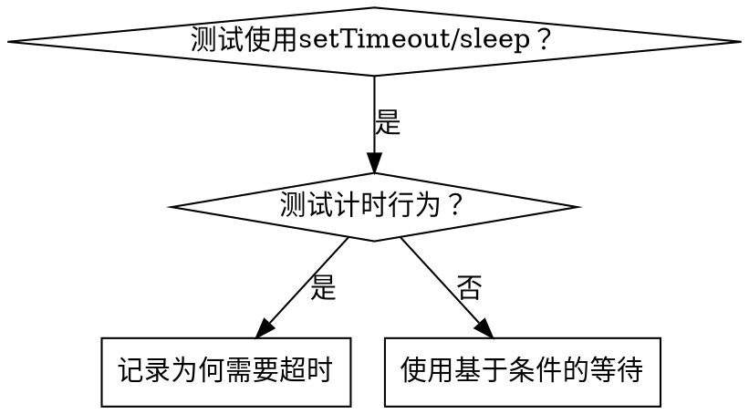

# 基于条件的等待

## 概述

不稳定的测试通常通过随意猜测延迟时间来设定等待时间。这会导致竞态条件，使得测试在快速机器上通过，但在负载下或CI环境中失败。

**核心原则：** 等待你真正关心的条件，而不是猜测需要多长时间。

## 何时使用



**在以下情况使用：**
- 测试包含随意延迟（`setTimeout`、`sleep`、`time.sleep()`）
- 测试不稳定（有时通过，负载下失败）
- 并行运行时测试超时
- 等待异步操作完成

**不要在以下情况使用：**
- 测试实际的计时行为（防抖、节流间隔）
- 如果使用任意超时，务必记录原因

## 核心模式

```typescript
// ❌ 之前：猜测时间
await new Promise(r => setTimeout(r, 50));
const result = getResult();
expect(result).toBeDefined();

// ✅ 之后：等待条件
await waitFor(() => getResult() !== undefined);
const result = getResult();
expect(result).toBeDefined();
```

## 快速模式

| 场景 | 模式 |
|----------|---------|
| 等待事件 | `waitFor(() => events.find(e => e.type === 'DONE'))` |
| 等待状态 | `waitFor(() => machine.state === 'ready')` |
| 等待数量 | `waitFor(() => items.length >= 5)` |
| 等待文件 | `waitFor(() => fs.existsSync(path))` |
| 复杂条件 | `waitFor(() => obj.ready && obj.value > 10)` |

## 实现

通用轮询函数：
```typescript
async function waitFor<T>(
  condition: () => T | undefined | null | false,
  description: string,
  timeoutMs = 5000
): Promise<T> {
  const startTime = Date.now();

  while (true) {
    const result = condition();
    if (result) return result;

    if (Date.now() - startTime > timeoutMs) {
      throw new Error(`等待 ${description} 超时，已等待 ${timeoutMs}ms`);
    }

    await new Promise(r => setTimeout(r, 10)); // 每10ms轮询一次
  }
}
```

查看本目录下的 `condition-based-waiting-example.ts` 文件，获取包含来自实际调试会话的领域特定辅助函数（`waitForEvent`、`waitForEventCount`、`waitForEventMatch`）的完整实现。

## 常见错误

**❌ 轮询过快：** `setTimeout(check, 1)` - 浪费CPU
**✅ 修复：** 每10ms轮询一次

**❌ 无超时：** 如果条件永不满足，则无限循环
**✅ 修复：** 始终包含带有明确错误的超时

**❌ 陈旧数据：** 在循环前缓存状态
**✅ 修复：** 在循环内调用获取器以获取最新数据

## 何时使用任意超时是正确的

```typescript
// 工具每100ms触发一次 - 需要2次触发来验证部分输出
await waitForEvent(manager, 'TOOL_STARTED'); // 第一步：等待条件
await new Promise(r => setTimeout(r, 200));   // 然后：等待计时行为
// 200ms = 100ms间隔的2次触发 - 已记录并合理说明
```

**要求：**
1. 首先等待触发条件
2. 基于已知时间（非猜测）
3. 注释说明原因

## 实际影响

来自调试会话（2025-10-03）：
- 修复了3个文件中的15个不稳定测试
- 通过率：60% → 100%
- 执行时间：加快40%
- 不再有竞态条件
