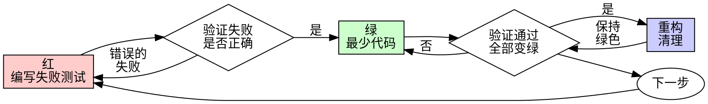

# 测试驱动开发（TDD）

## 概述

先写测试。看着它失败。编写最少代码使其通过。

**核心原则：** 如果你没看到测试失败，就不知道它是否测试了正确的东西。

**违反规则的字面意义就是违反规则的精神。**

## 何时使用

**始终使用：**
- 新功能
- 错误修复
- 重构
- 行为变更

**例外情况（询问你的真人搭档）：**
- 一次性原型
- 生成的代码
- 配置文件

想着“就这一次跳过TDD”？停下。这是自我合理化。

## 铁律

```
没有失败测试在先，就没有生产代码
```

先写代码再写测试？删除它。重新开始。

**没有例外：**
- 不要把它当作“参考”
- 不要边写测试边“调整”它
- 不要看它
- 删除就是删除

完全从测试开始实现。句号。

## 红-绿-重构



### 红 - 编写失败测试

编写一个最小测试，展示应该发生什么。

<好>
```typescript
test('重试失败操作3次', async () => {
  let attempts = 0;
  const operation = () => {
    attempts++;
    if (attempts < 3) throw new Error('失败');
    return '成功';
  };

  const result = await retryOperation(operation);

  expect(result).toBe('成功');
  expect(attempts).toBe(3);
});
```
名称清晰，测试真实行为，单一职责
</好>

<坏>
```typescript
test('重试有效', async () => {
  const mock = jest.fn()
    .mockRejectedValueOnce(new Error())
    .mockRejectedValueOnce(new Error())
    .mockResolvedValueOnce('成功');
  await retryOperation(mock);
  expect(mock).toHaveBeenCalledTimes(3);
});
```
名称模糊，测试模拟而非代码
</坏>

**要求：**
- 单一行为
- 名称清晰
- 真实代码（除非不可避免，否则不使用模拟）

### 验证红 - 看着它失败

**强制要求。永不跳过。**

```bash
npm test path/to/test.test.ts
```

确认：
- 测试失败（而非错误）
- 失败信息符合预期
- 因功能缺失而失败（非拼写错误）

**测试通过？** 你在测试现有行为。修复测试。

**测试错误？** 修复错误，重新运行直到正确失败。

### 绿 - 最少代码

编写最简单的代码使测试通过。

<好>
```typescript
async function retryOperation<T>(fn: () => Promise<T>): Promise<T> {
  for (let i = 0; i < 3; i++) {
    try {
      return await fn();
    } catch (e) {
      if (i === 2) throw e;
    }
  }
  throw new Error('不可达');
}
```
刚好足够通过
</好>

<坏>
```typescript
async function retryOperation<T>(
  fn: () => Promise<T>,
  options?: {
    maxRetries?: number;
    backoff?: 'linear' | 'exponential';
    onRetry?: (attempt: number) => void;
  }
): Promise<T> {
  // YAGNI（你不需要它）
}
```
过度设计
</坏>

不要添加功能、重构其他代码或“改进”超出测试范围的内容。

### 验证绿 - 看着它通过

**强制要求。**

```bash
npm test path/to/test.test.ts
```

确认：
- 测试通过
- 其他测试仍然通过
- 输出纯净（无错误、警告）

**测试失败？** 修复代码，而非测试。

**其他测试失败？** 立即修复。

### 重构 - 清理

仅在变绿后：
- 消除重复
- 改进命名
- 提取辅助函数

保持测试绿色。不要添加行为。

### 重复

为下一个功能编写下一个失败测试。

## 好的测试

| 品质 | 好 | 坏 |
|---------|------|-----|
| **最小化** | 单一职责。名称中有“和”？拆分它。 | `test('验证邮箱和域名和空格')` |
| **清晰** | 名称描述行为 | `test('测试1')` |
| **展示意图** | 演示期望的API | 模糊代码应做什么 |

## 顺序为何重要

**“我会在之后写测试来验证它有效”**

事后编写的测试会立即通过。立即通过证明不了什么：
- 可能测试了错误的东西
- 可能测试了实现而非行为
- 可能遗漏了你忘记的边缘情况
- 你从未看到它捕获错误

测试先行迫使你看到测试失败，证明它确实测试了某些东西。

**“我已经手动测试了所有边缘情况”**

手动测试是临时的。你以为测试了一切但：
- 没有记录你测试了什么
- 代码变更时无法重新运行
- 压力下容易忘记案例
- “我试的时候有效” ≠ 全面

自动化测试是系统性的。它们每次都以相同方式运行。

**“删除X小时的工作是浪费”**

沉没成本谬误。时间已经流逝。你现在选择：
- 删除并用TDD重写（再花X小时，高置信度）
- 保留并在事后添加测试（30分钟，低置信度，很可能有错误）

“浪费”在于保留你无法信任的代码。没有真实测试的工作代码是技术债务。

**“TDD是教条的，务实意味着适应”**

TDD就是务实的：
- 在提交前发现错误（比事后调试更快）
- 防止回归（测试立即捕获破坏）
- 记录行为（测试展示如何使用代码）
- 支持重构（自由更改，测试捕获破坏）

“务实”的捷径 = 在生产环境调试 = 更慢。

**“事后测试实现相同目标——这是精神而非仪式”**

不。事后测试回答“这做什么？”测试先行回答“这应该做什么？”

事后测试受你的实现影响。你测试你构建的，而非要求的。你验证你记得的边缘情况，而非发现的。

测试先行迫使在实现前发现边缘情况。事后测试验证你记得了一切（你没有）。

30分钟的事后测试 ≠ TDD。你获得了覆盖率，失去了测试有效的证明。

## 常见合理化借口

| 借口 | 现实 |
|--------|---------|
| “太简单无需测试” | 简单代码也会出错。测试只需30秒。 |
| “我之后会测试” | 测试立即通过证明不了什么。 |
| “事后测试实现相同目标” | 事后测试 = “这做什么？”测试先行 = “这应该做什么？” |
| “已经手动测试过” | 临时 ≠ 系统。无记录，无法重新运行。 |
| “删除X小时是浪费” | 沉没成本谬误。保留未验证代码是技术债务。 |
| “保留作参考，先写测试” | 你会调整它。那就是事后测试。删除就是删除。 |
| “需要先探索” | 可以。丢弃探索，用TDD开始。 |
| “测试困难 = 设计不清晰” | 倾听测试。难以测试 = 难以使用。 |
| “TDD会拖慢我” | TDD比调试更快。务实 = 测试先行。 |
| “手动测试更快” | 手动测试无法证明边缘情况。每次变更你都会重新测试。 |
| “现有代码没有测试” | 你在改进它。为现有代码添加测试。 |

## 危险信号 - 停止并重新开始

- 先写代码后写测试
- 实现后测试
- 测试立即通过
- 无法解释测试为何失败
- 测试“稍后”添加
- 合理化“就这一次”
- “我已经手动测试过了”
- “事后测试实现相同目的”
- “这是精神而非仪式”
- “保留作参考”或“调整现有代码”
- “已经花了X小时，删除是浪费”
- “TDD是教条的，我是务实的”
- “这次不同因为……”

**所有这些都意味着：删除代码。用TDD重新开始。**

## 示例：错误修复

**错误：** 接受空邮箱

**红**
```typescript
test('拒绝空邮箱', async () => {
  const result = await submitForm({ email: '' });
  expect(result.error).toBe('邮箱必填');
});
```

**验证红**
```bash
$ npm test
失败：期望'邮箱必填'，得到undefined
```

**绿**
```typescript
function submitForm(data: FormData) {
  if (!data.email?.trim()) {
    return { error: '邮箱必填' };
  }
  // ...
}
```

**验证绿**
```bash
$ npm test
通过
```

**重构**
如果需要，为多个字段提取验证逻辑。

## 验证清单

在标记工作完成前：

- [ ] 每个新函数/方法都有测试
- [ ] 在实现前看到每个测试失败
- [ ] 每个测试因预期原因失败（功能缺失，非拼写错误）
- [ ] 编写了最少代码使每个测试通过
- [ ] 所有测试通过
- [ ] 输出纯净（无错误、警告）
- [ ] 测试使用真实代码（仅在不可避免时使用模拟）
- [ ] 覆盖边缘情况和错误

无法勾选所有项？你跳过了TDD。重新开始。

## 遇到困难时

| 问题 | 解决方案 |
|---------|----------|
| 不知道如何测试 | 写下期望的API。先写断言。询问你的真人搭档。 |
| 测试太复杂 | 设计太复杂。简化接口。 |
| 必须模拟一切 | 代码耦合太紧。使用依赖注入。 |
| 测试设置庞大 | 提取辅助函数。仍然复杂？简化设计。 |

## 调试集成

发现错误？编写重现错误的失败测试。遵循TDD循环。测试证明修复并防止回归。

永远不要在没有测试的情况下修复错误。

## 测试反模式

添加模拟或测试工具时，阅读@testing-anti-patterns.md以避免常见陷阱：
- 测试模拟行为而非真实行为
- 向生产类添加仅测试方法
- 在不理解依赖关系的情况下模拟

## 最终规则

```
生产代码 → 测试存在且先失败
否则 → 不是TDD
```

未经你的真人搭档许可，没有例外。
