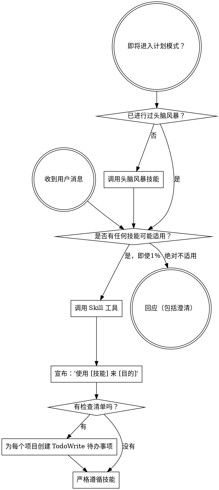

<SUBAGENT-STOP>
如果你被派发为子代理来执行特定任务，请跳过此技能。
</SUBAGENT-STOP>

<EXTREMELY-IMPORTANT>
如果你认为有哪怕1%的可能性某个技能适用于你正在做的事情，你**绝对必须**调用该技能。

**如果某个技能适用于你的任务，你没有选择。你必须使用它。**

这没有商量余地。这不是可选的。你不能通过合理化来逃避这一点。
</EXTREMELY-IMPORTANT>

## 指令优先级

超能力技能会覆盖默认系统提示行为，但**用户指令始终具有最高优先级**：

1. **用户的明确指令**（CLAUDE.md、GEMINI.md、AGENTS.md、直接请求）——最高优先级
2. **超能力技能**——在冲突时覆盖默认系统行为
3. **默认系统提示**——最低优先级

如果 CLAUDE.md、GEMINI.md 或 AGENTS.md 说“不要使用 TDD”，而某个技能说“始终使用 TDD”，请遵循用户指令。用户拥有控制权。

## 如何访问技能

**在 Claude Code 中：** 使用 `Skill` 工具。当你调用一个技能时，其内容会被加载并呈现给你——请直接遵循它。切勿对技能文件使用 Read 工具。

**在 Copilot CLI 中：** 使用 `skill` 工具。技能会自动从已安装的插件中发现。`skill` 工具的工作方式与 Claude Code 的 `Skill` 工具相同。

**在 Gemini CLI 中：** 技能通过 `activate_skill` 工具激活。Gemini 在会话开始时加载技能元数据，并按需激活完整内容。

**在其他环境中：** 请查阅你所在平台的文档以了解技能如何加载。

## 平台适配

技能使用 Claude Code 的工具名称。对于非 CC 平台：请参阅 `references/copilot-tools.md`（Copilot CLI）、`references/codex-tools.md`（Codex）以获取等效工具。Gemini CLI 用户通过 GEMINI.md 自动加载工具映射。

# 使用技能

## 规则

**在给出任何回应或采取任何行动之前，先调用相关或被请求的技能。** 即使只有1%的可能性某个技能可能适用，你也应该调用该技能来检查。如果调用的技能最终不适用于当前情况，你不需要使用它。

## 危险信号

这些想法意味着**停止**——你正在合理化：

| 想法 | 现实 |
|---------|---------|
| “这只是个简单问题” | 问题就是任务。检查是否有适用技能。 |
| “我需要先获取更多上下文” | 技能检查**先于**澄清性问题。 |
| “让我先探索一下代码库” | 技能会告诉你**如何**探索。先检查。 |
| “我可以快速查看 git/文件” | 文件缺乏对话上下文。检查是否有技能。 |
| “让我先收集信息” | 技能会告诉你**如何**收集信息。 |
| “这不需要一个正式的技能” | 如果技能存在，就使用它。 |
| “我记得这个技能” | 技能会演变。阅读当前版本。 |
| “这不算一个任务” | 行动 = 任务。检查是否有技能。 |
| “这个技能太小题大做了” | 简单的事情会变得复杂。使用它。 |
| “我先做这一件事” | 在做**任何事**之前先检查。 |
| “这感觉很有成效” | 无纪律的行动会浪费时间。技能能防止这一点。 |
| “我知道那是什么意思” | 知道概念 ≠ 使用技能。调用它。 |

## 技能优先级

当多个技能可能适用时，使用以下顺序：

1. **流程技能优先**（头脑风暴、调试）——这些决定了**如何**处理任务
2. **实现技能其次**（前端设计、mcp-builder）——这些指导执行

“让我们构建 X” → 先头脑风暴，然后实现技能。
“修复这个 bug” → 先调试，然后领域特定技能。

## 技能类型

**严格型**（TDD、调试）：严格遵循。不要偏离纪律。

**灵活型**（模式）：根据上下文调整原则。

技能本身会告诉你属于哪种类型。

## 用户指令

指令说明**做什么**，而不是**怎么做**。“添加 X”或“修复 Y”并不意味着跳过工作流程。
